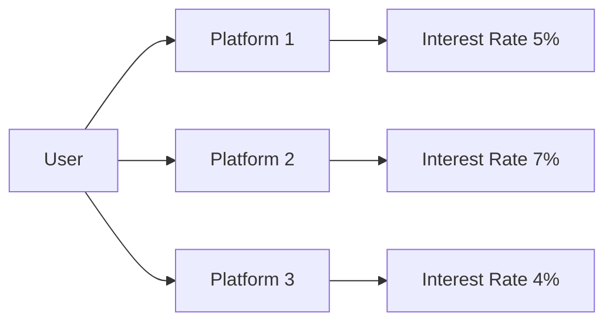
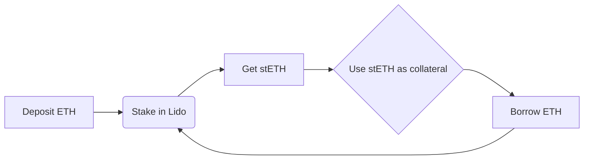
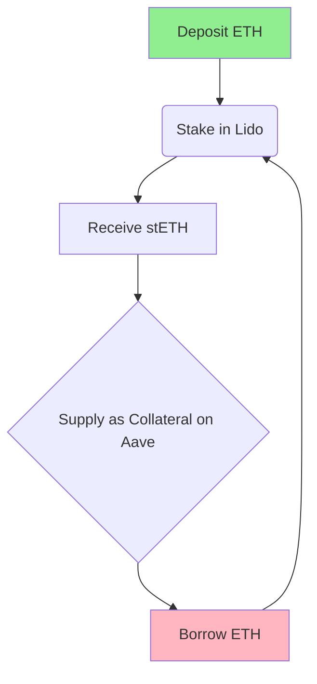

# tAsset Whitepaper Summary

## Context

* **DeFi**: Decentralised Finance
* **On-chain**: Activities that happen directly on a blockchain *(eg. Ethereum)*, using smart contracts to automate actions like lending and borrowing
* **Fragmented on-chain interest rates**: Current interest rates (for lending or staking your digital assets) are inconsistent across different blockchain networks and DeFi platforms

* **Basic Staking:** Lock up your cryptocurrency (its no longer liquid) to secure the network and earn rewards based on fixed interest rates
* **Leveraged staking strategies**: Advanced DeFi methods to increase the amount of stakeable cryptocurrency for greater rewards at higher risk, occurs by using your staked assets as collateral to borrow more cryptocurrency, then staking that borrowed amount as well *(can be looped multiple times)*

## Thesis

tAssets aim to unify fragmented on-chain interest rates through leveraged staking strategies. 

They want to start with tETH on Ethereum. 

The protocol seeks to outperform standard liquid staking tokens *(eg. stETH)* while maintaining risk-managed exposure to DeFi yield opportunities.

## Key Arguments

### Value Proposition

* **Interest Rate Arbitrage**: Closes gaps between ETH staking yields and lending market rates through recursive leveraged positions
* **Dual Utility**: tETH functions as both yield-bearing asset and collateral for Decentralized Offered Rates (DOR) benchmark system
* **Security Integration**: tETH holders contribute to cryptoeconomic security of Treehouse's Actively Validated Service (AVS)

### Risk Management

* **Depeg Protection**: Historical backtesting shows 30-40% buffer against LST depeg events
* **Interest Rate Safeguards**: Automatic position unwinding when borrowing costs exceed staking yields
* **Protocol Backstops**: Insurance fund and collateral haircuts mitigate liquidation risks

## Technical Mechanisms

### Strategy Parameters

| Component            | Specification          |
|----------------------|------------------------|
| Base Asset           | ETH                    |
| LST Platform         | Lido                   |
| Lending Market       | Aave                   |
| Max Leverage         | 4x (Theoretical)       |
| Position Rebalancing | Oracle-triggered |

## Expansion Possibilities

### Vertical Integration

* **Multi-Chain tAssets**: Replicate ETH strategy for other PoS assets *(SOL, DOT)*
* **Fixed Income Products**: Use DOR to create interest rate swaps/forwards
* **Real-World Asset Bridge**: Tokenize traditional bonds using tAsset infrastructure

### Protocol Evolution

* **Decentralized Governance**: Transition risk parameters to DAO control
* **Restaking Integration**: Use EigenLayer for additional yield streams
* **NFT Incentives**: Squirrel NFTs boost yield through gamification

## Shortcomings & Risks

### Technical Limitations

* **LST Dependency**: Entire strategy relies on Lido's stETH stability
* **Oracle Risks**: Price feed manipulation could trigger false liquidations
* **Smart Contract Complexity**: 14+ security audits in progress

### Market Risks

| Risk Factor          | Mitigation Strategy               |
|----------------------|-----------------------------------|
| Yield Compression    | Dynamic leverage adjustments |
| Regulatory Uncertainty| Jurisdiction-based access controls |
| MEV Extraction       | Private transaction relays |

### Adoption Challenges

* High gas costs for frequent rebalancing *(approx $12/position adjustment)*
* Requires minimum 32 ETH for optimal strategy efficiency
